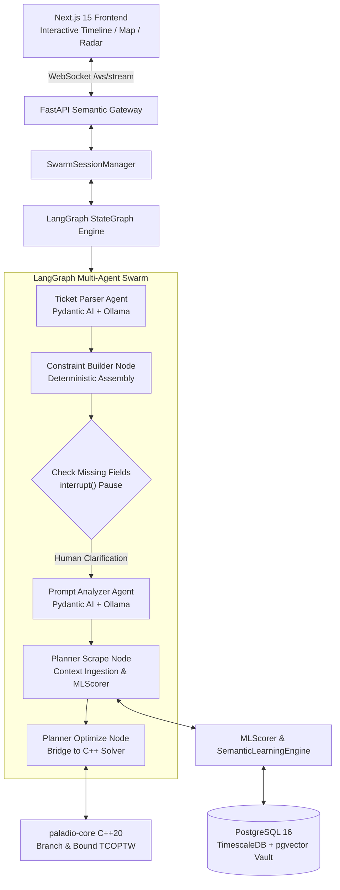

<div align="center">


# Paladio
### Continuous & Sovereign Autonomous Travel Optimization Engine

[](./LICENSE)
[](https://www.python.org/)
[](https://nextjs.org/)
[](https://langchain-ai.github.io/langgraph/)
[](https://ai.pydantic.dev/)
[](https://github.com/Leandro-Juan/paladio-core)
[](https://github.com/pgvector/pgvector)
[](#sovereign-mandate)
[](./docker-compose.yml)

**A 100% self-hosted, air-gappable travel intelligence platform bridging stochastic agentic swarms, continuous differentiable machine learning, and sub-millisecond C++20 combinatorial routing.**

[Documentation Portal](https://leandro-juan.github.io/paladio/) • [Architecture](#-macro-system-architecture) • [LangGraph Swarm](#-spotlight-1-langgraph-multi-agent-swarm) • [ML Taste Learning](#-spotlight-2-continuous-machine-learning--semantic-taste-learning) • [Knowledge Vault](#-spotlight-3-poi-knowledge-vault--transit-database) • [Frontend UI](#-spotlight-4-reactive-nextjs-15-frontend) • [Roadmap](#-strategic-product--technical-roadmap) • [Quickstart](#-3-step-quickstart)

---

</div>

## 💡 Executive Summary

Modern AI applications suffer from an architectural tension: **Large Language Models (LLMs) are expressive and conversational, but notoriously unreliable at arithmetic, constraint satisfaction, and combinatorial optimization.** When applied to complex scheduling (e.g., flight connections, opening hours, walking fatigue, and strict financial budgets), purely probabilistic agents hallucinate infeasible paths.

**Paladio solves this through a hybrid, multi-paradigm architecture:**
1. **Stochastic Reasoning & NLP Extraction:** Quantized local models (`Llama 3.1 8B`, `Qwen 2.5 7B` via Ollama) parse unstructured tickets and user prompts into structured models under strict **Pydantic AI guardrails**.
2. **Deterministic Combinatorial Optimization:** An ultra-fast, compiled **C++20 branch-and-bound engine** (`paladio-core`) solves the NP-hard Time-Constrained Orienteering Problem with Time Windows (**TCOPTW**) in micro-to-milliseconds with zero dynamic heap allocations in hot loops.
3. **Continuous Taste Learning:** A **768-D semantic hypersphere** backed by `pgvector` that updates permanent user preferences via Exponential Moving Average (EMA) and projects them into **8-D harmonic affinity radars**.
4. **Absolute Data Sovereignty:** **Zero external cloud API calls** (no OpenAI, no Google Maps, no cloud subscriptions). The entire system runs locally inside Docker containers on standard hardware (x86_64, ARM64, Apple Silicon).

---

## 🏛️ Macro System Architecture



---

## 🤖 Spotlight 1: LangGraph Multi-Agent Swarm

The conversational intelligence in Paladio is orchestrated using **LangGraph** (`StateGraph`), enforcing a deterministic finite state machine over conversational LLM interactions.

```text
[START] ──> ticket_parser ──> assemble_constraints ──> check_missing ──> prompt_analyzer ──> planner_scrape ──> planner_optimize ──> [END]
                                                             │
                                                    (Missing Fields?)
                                                             │
                                                             ▼
                                                    interrupt() [PAUSE]
                                                    (Stream to WebSocket)
```

### 1. Cyclical Self-Correction & Pydantic AI Firewall
- LLMs frequently hallucinate invalid JSON structures. Instead of exposing downstream systems to raw text, Paladio fences all agents (`ticket_parser`, `prompt_analyzer`) with **Pydantic AI**.
- If a model outputs an invalid response, LangGraph cycles back with error feedback, allowing the model to repair its schema automatically without user disruption.
- Output models like `BookingAnchors` and `TravelConstraints` enforce strict physical limits (positive budgets, validated ISO-8601 timestamps, IATA codes).

### 2. Non-Blocking Human-In-The-Loop (`interrupt()`)
- When vital parameters are missing (e.g., origin airport, budget, or mandatory meal intervals), the graph halts cleanly using LangGraph's native `interrupt()` function.
- The session state is captured in persistent checkpointers (`MemorySaver` / Redis). The WebSocket gateway streams a structured questionnaire to the client.
- Once the user submits their answers, execution resumes at the exact pause point with no duplicate inference or lost conversational context.

---

## 🧠 Spotlight 2: Continuous Machine Learning & Semantic Taste Learning

Recommendation in Paladio is neither static nor reliant on heavy external fine-tuning. It utilizes a continuous vector-space model operating directly on local hardware.

### 1. 768-D Semantic Hypersphere & pgvector RAG
- Unstructured user requests and POI descriptions are mapped into a dense 768-dimensional space via local Ollama instances running `nomic-embed-text`.
- Attractions are indexed using `pgvector` with HNSW/IVFFlat cosine indexing (`<=>`), enabling sub-millisecond semantic retrieval across thousands of venues.

### 2. Online Exponential Moving Average (EMA) Taste Learning
User taste is not static. Every interaction dynamically adapts the user's permanent 768-D latent vector $\mathbf{v}_{\text{user}}$ using an Exponential Moving Average:

$$\mathbf{v}_{\text{new}} = \text{Normalize}\Big((1 - \gamma)\,\mathbf{v}_{\text{hist}} + \gamma\,\mathbf{v}_{\text{prompt}}\Big) \quad \text{with } \gamma = 0.20$$

This allows the platform to organically adapt to shifting user preferences (e.g., transitioning from active sightseeing to culinary relaxation) across multiple sessions.

### 3. Continuous-to-Discrete Harmonic Radar Projection
High-dimensional latent embeddings are impossible for users to interpret directly. Paladio projects the continuous 768-D semantic vector onto 8 canonical category anchors:

$$\mathbf{a}_k = \frac{\mathbf{v} \cdot \mathbf{u}_k + 1}{2} \quad \text{for } k \in [1, \dots, 8]$$

```text
       Art & Culture
             ▲
   Nightlife │   History & Heritage
        ╲    │    ╱
         ╲   │   ╱
          ╲  │  ╱
Scenic ────┼──── Architecture
Views     ╱  │  ╲
         ╱   │   ╲
        ╱    │    ╲
   Shopping  │   Nature & Outdoors
             ▼
       Food & Culinary
```

These 8 harmonic affinities (`art_culture`, `history_heritage`, `nature_outdoors`, `architecture`, `food_culinary`, `nightlife`, `shopping`, `scenic_views`) feed directly into real-time SVG Radar telemetry on the frontend.

### 4. Deterministic 16-D `PoiEncoder` & Bayesian Scoring
Each venue is encoded into an interpretable 16-dimensional feature vector via pure NumPy:
- **Indices `[0..7]`:** Normalized cost, duration, outdoor flags, and Bayesian smoothed rating:
  $$S_{\text{qual}} = \frac{R \cdot v + C \cdot m}{v + m} \quad (m = 50 \text{ reviews}, C = 4.0 \text{ prior})$$
- **Indices `[8..15]`:** Multi-hot categorical activations parsed via pre-compiled regular expressions.
- **`HybridSovereignScorer`:** Synthesizes quality, tag affinity dot-products, pacing curves, and budget efficiency into a final calibrated score in $[0.0, 100.0]$.

---

## 🗄️ Spotlight 3: POI Knowledge Vault & Transit Database

The foundation of Paladio's offline capabilities is its self-contained PostgreSQL 16 database equipped with `TimescaleDB` and `pgvector`:

```sql
-- attractions table core layout
CREATE TABLE attractions (
    id VARCHAR PRIMARY KEY,
    city VARCHAR NOT NULL,
    name VARCHAR NOT NULL,
    category VARCHAR NOT NULL,
    embedding vector(768),                         -- Local semantic embedding
    open_time_mins_by_day INTEGER[] NOT NULL,     -- 7-day opening times (e.g. 480 = 08:00)
    close_time_mins_by_day INTEGER[] NOT NULL,    -- 7-day closing times (e.g. 1320 = 22:00)
    duration_mins INTEGER NOT NULL DEFAULT 60,
    cost_eur DOUBLE PRECISION NOT NULL DEFAULT 0.0,
    cost_is_estimated BOOLEAN NOT NULL DEFAULT true,
    location JSONB NOT NULL,                      -- {lat, lon, address}
    scoring JSONB NOT NULL,                       -- {google_rating, reviews}
    metadata JSONB NOT NULL                       -- {description, tags, website}
);
CREATE INDEX idx_city_category ON attractions(city, category);
```

- **Automated Embedding Hydration:** The CLI tool `python -m app.cli.hydrate_pois` runs `PoiNaturalLanguageSynthesizer` to automatically generate descriptive texts and embed unindexed POIs in batches.
- **Multimodal Transit Engine:** Local Valhalla routing coupled with `transit_cache` (OSM and GTFS feed status) and `city_transit_fares` (single tickets, 24h passes, airport surcharges) computes realistic door-to-door transit times without external mapping APIs.

---

## 💻 Spotlight 4: Reactive Next.js 15 Frontend

Paladio features a modern, responsive UI built with **Next.js 15 (App Router)**, **React**, and **Tailwind CSS**:

- **`TripTimeline`:** Dynamic schedule cards detailing visit windows, buffer times, meal pacing, and financial tallies.
- **`PreferenceRadar`:** Interactive SVG 8-axis radar chart reflecting real-time ML taste evolution as the user chats with the swarm.
- **`VaultMap`:** Geospatial map (Leaflet/MapLibre) displaying POI clusters, visit sequences, and walking corridors.
- **`TransitLegView`:** Step-by-step public transit directions (metro lines, platform transfers, walking paths).
- **Persistent WebSocket Streaming:** `/ws/stream` receives fine-grained lifecycle telemetry (`EXTRACTING_CONSTRAINTS`, `SCORING_POIS`, `SOLVING_TSPTW`), providing immediate feedback during heavy computations.

---

## ⚡ Combinatorial Solver Submodule (`paladio-core`)

The combinatorial heavy lifting is offloaded to [`paladio-core`](https://github.com/Leandro-Juan/paladio-core), located in `cpp_core/` and automatically synchronized via GitHub Actions (`.github/workflows/sync_core.yml`).

- **Mathematical Problem:** Time-Constrained Orienteering Problem with Time Windows (**TCOPTW**), strongly NP-hard ($O(N!)$ naive search space).
- **Algorithmic Engine:**
  1. *Continuous Fractional Knapsack Upper Bounding:* Admissible linear relaxation pruning unpromising branches in $O(N)$ time.
  2. *64-Bit Bitmask State Encoding:* Sub-nanosecond node visitation tests using CPU hardware intrinsics (`std::countr_zero`).
  3. *Pareto Dominance Pruning:* Eliminating trajectories arriving later at higher cost with inferior scores.
  4. *Zero-Allocation Recursion:* Static memory layouts guaranteeing sub-millisecond execution times.
- **Integration:** Python interfaces directly with the compiled binary via `pybind11`, releasing the GIL (`pybind11::gil_scoped_release`) during intensive branch-and-bound searches.

---

## 🗺️ Strategic Product & Technical Roadmap

Paladio follows a phased engineering roadmap balancing foundational algorithms, distributed infrastructure, and intuitive user experiences:

| Horizon | Milestone | Status | Key Deliverables & Architectural Focus |
| :--- | :--- | :---: | :--- |
| **Phase 1** | **Deterministic Combinatorial Core** | **Completed** | C++20 TCOPTW Branch & Bound solver, continuous knapsack upper bounding, bitmasks, `pybind11` zero-copy bindings ([`paladio-core`](https://github.com/Leandro-Juan/paladio-core)). |
| **Phase 2** | **Reactive Semantic Gateway & Swarm** | **Completed** | FastAPI WebSocket streaming, LangGraph StateGraph, Pydantic AI local Ollama agents, `interrupt()` human-in-the-loop. |
| **Phase 3** | **Continuous ML & Knowledge Vault** | **Completed** | 768-D `pgvector` RAG, online EMA taste evolution, 8-D harmonic projection radar, 16-D `PoiEncoder`, POI batch hydration. |
| **Phase 4** | **Reactive UI & Interactive Experience** | **Active / In Progress** | Elite Next.js 15 frontend: dynamic `TripTimeline` pacing, real-time WebSocket state streaming, interactive SVG `PreferenceRadar`, geospatial `VaultMap`, and multimodal `TransitLegView`. |
| **Phase 5** | **Distributed Ingestion & Anti-Ban Scraping** | **Upcoming** | Celery Beat cron cluster, Playwright stealth scrapers, residential proxy rotation, exponential backoff with jitter. |
| **Phase 6** | **In-Memory Matching & Anomaly Detection** | **Upcoming** | C++ RAM 2D Interval Tree daemon ($O(\log N + K)$ alert matching without disk I/O), TimescaleDB empirical price CDFs, 1-Wasserstein regime shift detection. |
| **Phase 7** | **Interactive Re-Planning & MCP Server** | **Planned** | Conversational post-plan re-routing (swapping POIs, adjusting pace dynamically), native Paladio Model Context Protocol (MCP) Server for external AI agent integration. |
| **Phase 8** | **Environmental Routing & Sovereign Sync** | **Future** | Micro-climate sun/shade street routing via solar azimuth models, self-hosted Immich/Syncthing photo vault sync, multi-city GTFS global feeds. |

---

## 🚀 3-Step Quickstart

### Prerequisites
- Docker Engine 24.0+ & Docker Compose v2+
- 16 GB RAM recommended (for local LLM inference)

### 1. Clone the Repository
```bash
git clone https://github.com/Leandro-Juan/Paladio.git
cd Paladio
```

### 2. Configure Environment
```bash
cp .env.example .env
# Paladio works out-of-the-box with default local settings!
```

### 3. Launch the Sovereign Stack
```bash
docker compose up -d
```

Once running:
- **Next.js Web Interface:** [`http://localhost:3000`](http://localhost:3000)
- **FastAPI Documentation:** [`http://localhost:8000/docs`](http://localhost:8000/docs)
- **WebSocket Gateway:** `ws://localhost:8000/ws/stream`
- **Documentation Portal:** [`https://leandro-juan.github.io/paladio/`](https://leandro-juan.github.io/paladio/)

---

## 📜 Authorship & Legal Licensing

**Paladio** is designed, architected, and maintained by **[Leandro Juan](https://github.com/Leandro-Juan)**.

This software is released under the **[GNU Affero General Public License v3.0 (AGPLv3)](./LICENSE)**:
- **Maximum Copyleft Protection:** Anyone offering modified versions of Paladio across a network or as a cloud service must make their complete source code publicly available under AGPLv3.
- **Authorship Preservation:** Consistent with standard AGPLv3 Section 4 & 7 legal notice preservation practices, original copyright notices and interactive user interface attributions (*"Powered by Paladio | Created by Leandro Juan"*) must be preserved.
- **Contributions:** Contributions are welcomed under our [Contributing Guidelines](./CONTRIBUTING.md) and Developer Certificate of Origin (DCO 1.1).

---

<div align="center">
  <sub>Engineered with mathematical rigor and sovereignty by Leandro Juan • Madrid, Spain</sub>
</div>
