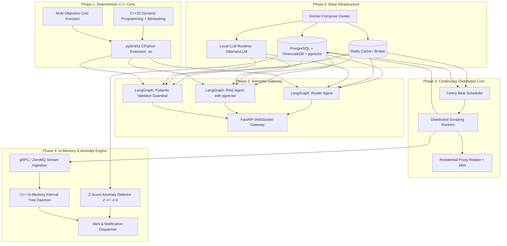

# Sovereign Travel Optimization Engine — Technical Roadmap

> **Architectural Reference:** [Documento de Arquitectura Soberana.pdf](./Documento%20de%20Arquitectura%20Soberana.pdf)  
> **Core Architecture:** 100% Offline, Self-Hosted & Portable Sovereign AI (NLP/Extraction) + Deterministic Cross-Platform C++20 (CSP/Combinatorics) + Distributed Stream Engine (Python/Celery/TimescaleDB)
> **Prime Directive:** Absolute environment independence, zero cloud SaaS lock-in, hardware-agnostic execution, and full air-gap readiness across Linux (x86_64, ARM64) and macOS.

---

## 1. Strategic Horizon & Portfolio Balance

```
┌──────────────────────────────────────────────────────────────────────────┐
│                             PORTFOLIO ALLOCATION                         │
├──────────────────────────────┬─────────────────────────────┬─────────────┤
│ 40% Core Differentiators     │ 35% Foundational Engine     │ 25% Scale & │
│ - C++ TSPTW Bitmasking Core  │ - Local LLM & LangGraph     │   Hardening │
│ - In-Memory Interval Trees   │ - PostgreSQL + TimescaleDB  │ - Anti-Ban  │
│ - Z-Score Anomaly Engine     │ - FastAPI WebSocket Gateway │ - Security  │
└──────────────────────────────┴─────────────────────────────┴─────────────┘
```

---

## 2. Architecture Dependency Graph



---

## 3. Phased Execution Roadmap

### Phase 0: Infrastructure Foundation & Sovereignty Sandbox
**Objective:** Deploy and isolate the local host environment, ensuring a 100% self-hosted, air-gappable deployment with hardware-agnostic portability.

- [x] **0.1 Portable Isolated Container Topology (`docker-compose.yml`):**
  - Fully containerized, hardware-agnostic stack ensuring seamless portability.
  - PostgreSQL 16 with `TimescaleDB` and `pgvector` extensions enabled.
  - Redis 7 (broker for Celery and in-memory cache).
  - Local LLM engine (Ollama / vLLM) exposing port `11434` for Quantized models (`Llama 3.1 8B-Instruct-Q4_K_M` or `Qwen 2.5 7B`).
- [x] **1.2 Network & Boundary Hardening:**
  - Configure `ufw` to block all external ingress ports except the reverse proxy gateway.
- [x] **0.3 Healthcheck & Resource Benchmarking:**
  - Validate VRAM/RAM allocation under peak local inference loads (minimum 16GB total target).

---

### Phase 1: Portable Reactive Optimization Core (C++20 & pybind11)
**Objective:** Build the deterministic mathematical calculation core for travel itineraries with sub-50ms execution latency.

- [x] **1.1 TSPTW + Knapsack Modeling:**
  - Formulate graph search for points of interest (POI), transit times, opening windows, and financial budgets.
  - Implement dynamic programming with bitmask state representation `(visited_mask, current_node, elapsed_time)`.
- [x] **1.2 Multi-Objective Cost Function:**
  - Implement:  
    $$\min f(x) = \alpha \cdot C(x) + \beta \cdot T(x) - \gamma \cdot S(x)$$  
    Where $C(x)$ = total cost, $T(x)$ = transit/layover penalty, $S(x)$ = quality score, and $\alpha, \beta, \gamma$ are dynamic weights.
- [x] **1.3 CPython Bridge (`pybind11`):**
  - Export C++ data structures and solver entrypoints as a shared dynamic library (`.so`).
  - Add benchmark tests ensuring execution time $< 50\text{ms}$ for graphs up to 25 nodes (typical 5–7 day trip).

---

### Phase 2: Semantic Gateway & Multi-Agent Swarm (FastAPI + LangGraph)
**Objective:** Create the conversational front door with structured output validation and live WebSocket event streams.

- [x] **2.1 FastAPI WebSocket Gateway:**
  - Establish persistent WebSocket endpoints emitting structured granular progress states:  
    `["STARTING_INFERENCE", "EXTRACTING_CONSTRAINTS", "SCRAPING_OFFERS", "EVALUATING_ROUTES"]`.
- [x] **2.2 LangGraph Orchestration Pipeline:**
  - **Router Agent:** Classifies user intent (Reactive Itinerary Planning vs. Proactive Continuous Monitoring alert creation).
  - **RAG Agent:** Queries `pgvector` knowledge base for localized destination constraints (e.g., museum closures, transit policies).
  - **Validator Agent (The Guardrail):** Enforces strict Pydantic parsing on local LLM outputs. Automatically triggers re-prompting loop if budget or date constraints violate schema.
- [x] **2.3 End-to-End Reactive Integration:**
  - Connect validated Pydantic parameters to the compiled `pybind11` C++ solver and stream back the optimized itinerary.

---

### Phase 3: Continuous Ingestion & Anti-Ban Scraping (Celery Beat)
**Objective:** Build a 24/7 distributed cron worker cluster for real-time travel market price harvesting.

- [x] **3.1 Distributed Task Scheduling:**
  - Configure Celery Beat to dispatch scheduled scraping tasks to Redis queues at configurable $N$-minute intervals.
- [ ] **3.2 Resilient Scraping Workers:**
  - Implement async scrapers with `HTTPX` for lightweight API endpoints and `Playwright` for dynamic JavaScript single-page sites.
- [ ] **3.3 Anti-Ban Evasion Protocol:**
  - Integrate residential proxy pool rotation with randomized per-request routing.
  - Implement Exponential Backoff with Jitter: on HTTP 429 / CAPTCHA detection, suspend domain for $2^c + \text{jitter}$ seconds.

---

### Phase 4: In-Memory Matching & Anomaly Detection (C++ Daemon + TimescaleDB)
**Objective:** High-Frequency Trading level alert matching ($O(\log N + K)$) and statistical anomaly identification.

- [ ] **4.1 In-Memory Interval Tree Daemon (C++):**
  - Build persistent RAM-resident 2D Segment / Interval Tree storing active user alerts (Destination, Date Range, Max Price).
  - Expose a low-latency gRPC or ZeroMQ ingestion socket.
  - When Celery ingests flight prices, query Interval Tree in $O(\log N + K)$ time to identify matching user IDs without disk I/O bottlenecks.
- [ ] **4.2 TimescaleDB Hyper-Tables & Continuous Aggregates:**
  - Ingest raw time-series price points into partitioned hyper-tables.
  - Maintain 30-day rolling moving averages ($\mu$) and standard deviations ($\sigma$) per flight/hotel route.
- [ ] **4.3 Statistical Anomaly Classifier (Z-Score):**
  - Compute:  
    $$Z = \frac{X - \mu}{\sigma}$$
  - Trigger "Super Bargain" high-confidence notifications only when $Z \le -2.0$, filtering out noise and seasonal fluctuations.
- [ ] **4.4 Notification Dispatcher:**
  - Emit push notifications / emails containing pre-packaged itineraries for matched user alerts.

---

### Phase 5: Production Hardening, Profiling & Reliability
**Objective:** Stress-testing, memory safety verification, and operational resilience.

- [ ] **5.1 C++ Memory & Latency Profiling:**
  - Run AddressSanitizer and Valgrind to ensure zero memory leaks in the RAM Interval Tree daemon and `pybind11` bindings.
- [ ] **5.2 Concurrency & Load Stress Test:**
  - Simulate 50,000 active user alerts with 1,000 incoming price streams/minute to verify RAM stability and gRPC throughput.
- [ ] **5.3 Automated Recovery:**
  - Docker auto-restart policies, Celery worker heartbeat monitors, and database connection pooling.

---

## 4. Technical Risk & Mitigation Matrix

| Risk | Impact | Likelihood | Mitigation Strategy |
| :--- | :---: | :---: | :--- |
| **Cloud Dependency / Vendor Lock-in** | Critical | Low | Zero tolerance policy. Ensure all components (LLM, databases, logic) remain 100% self-hosted and air-gap compatible. |
| **Local LLM Hallucinations on Math/Budgets** | Critical | High | Hard constraint: Relegate LLMs to NLP only; enforce Pydantic Validator with auto-retry; all math solved in C++. |
| **Scraper IP Bans & CAPTCHAs** | High | High | Residential proxy pool rotation, Playwright stealth plugins, exponential backoff with jitter. |
| **Database I/O Bottleneck on 50K+ Alerts** | High | Medium | In-memory C++ Interval Tree daemon bypasses SQL disk queries on every ingestion tick. |
| **C++ / Python GIL Contention** | Medium | Medium | Release Python GIL (`pybind11::gil_scoped_release`) inside long C++ optimization loops. |
| **Host VRAM Exhaustion** | High | Low | Use 4-bit quantized GGUF/EXL2 models with strict context-window truncation. |

---

## 5. Milestone Definition of Done (DoD)

| Horizon | Deliverable | Acceptance Criteria |
| :--- | :--- | :--- |
| **M1: Core Solver** | C++ `.so` Dynamic Library | Solves 25-node TSPTW within `<50ms` and passes unit tests. |
| **M2: Reactive MVP** | FastAPI WebSocket + LangGraph | User input via WS produces validated itinerary in `<3s` without external APIs. |
| **M3: Proactive Pipeline** | Celery + Interval Tree Daemon | Ingests 1,000 prices/min and checks 50,000 alerts with zero disk I/O lag. |
| **M4: Anomaly Detection** | TimescaleDB Z-Score Engine | Flags offers with $Z \le -2.0$ over a 30-day baseline and dispatches alerts. |
