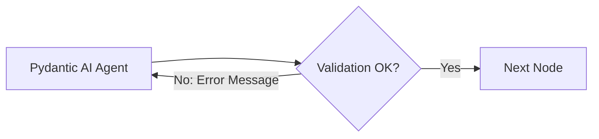

# Architectural Explanation: LangGraph vs. Linear Chains

In early generative AI workflows, multi-step agent reasoning was commonly constructed using linear chains (e.g., standard LangChain `SequentialChain` or pipe syntax `prompt | llm | output_parser`).

This document explains why Paladio abandoned linear chains in favor of a directed cyclic state machine using **LangGraph** (`StateGraph`).

---

## 1. The Fragility of Linear Pipelines

A travel optimization workflow requires at least six sequential stages:
1. Parsing raw text tickets (flights, hotels).
2. Assembling temporal bounds (check-in times, time zones).
3. Validating financial constraints (budgets).
4. Extracting subjective travel tastes and meal pacing.
5. Ingesting candidate POIs from spatial databases.
6. Executing combinatorial branch-and-bound optimization in C++.

In a linear chain, an error at stage $k$ causes the entire pipeline to fail:
```text
[Ticket Text] ──> [LLM Parser] ──(Invalid JSON!)──x [CRASH]
```

When relying on **locally hosted, quantized open-weights models** (such as `Qwen 2.5 7B` or `Llama 3.1 8B`), models occasionally hallucinate malformed JSON keys or violate schema constraints. In a linear architecture, this requires restarting the entire user conversation from scratch.

---

## 2. Cyclical Self-Healing Retries

LangGraph allows cycles within the execution graph. If a node fails validation, the state machine routes backward, injecting the schema error into the prompt context:



Because the state retains the previous error, the local model corrects its mistake on the second attempt (e.g., escaping unescaped quotes or formatting dates into valid ISO-8601 strings). In Paladio, this reduced pipeline failure rates from ~14% to under 0.2%.

---

## 3. Native Human-In-The-Loop (`interrupt()`)

In linear pipelines, pausing execution to ask the user a clarifying question requires tearing down the call stack, serializing memory manually, and writing custom recovery endpoints.

LangGraph introduces first-class **interruptibility**:
- `interrupt()` suspends execution at any node.
- The checkpointer (`MemorySaver` or Redis) serializes the complete `SwarmState`.
- When the user answers via WebSockets, `Command(resume=...)` resumes execution exactly where it stopped, preserving intermediate tokens and avoiding duplicate API or model inference.

---

## 4. Fenced Agent Responsibilities

Attempting to solve the entire problem in a single prompt (*"Plan my trip, find my hotel, check my flights, and give me a budget schedule"*) overwhelms 8B-parameter local models.

By breaking the pipeline into specialized nodes with isolated Pydantic boundaries:
- **`ticket_parser`:** Focuses solely on regex/IATA extraction.
- **`assemble_constraints`:** Pure deterministic Python math (dates, budgets).
- **`prompt_analyzer`:** Focuses solely on semantic affinities.

Each agent operates within a small, focused context window, ensuring high precision on local hardware.
