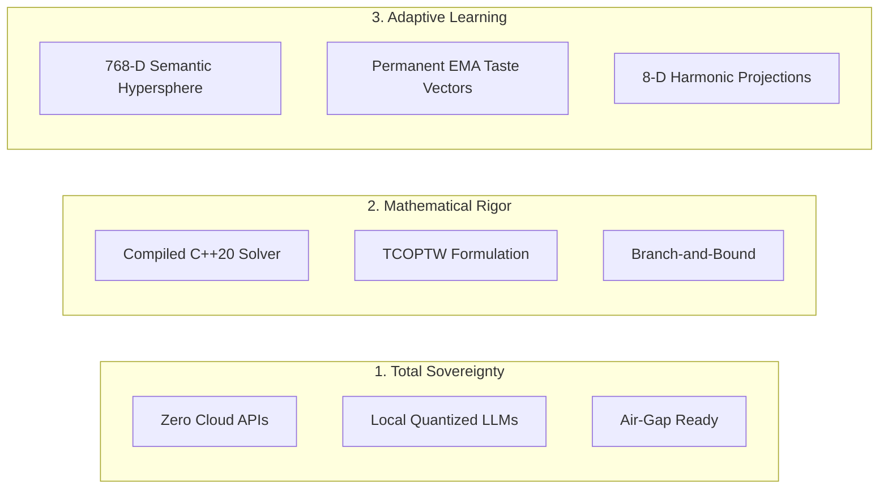

# Paladio Documentation Portal

Welcome to the technical documentation portal for **Paladio**, a 100% sovereign, air-gappable travel intelligence and combinatorial optimization platform.

Paladio bridges the gap between **conversational generative AI** and **provable mathematical optimization**, orchestrating multi-agent state machines, continuous semantic taste learning, and sub-millisecond C++ combinatorial routing on local hardware.

---

## 🏛️ The Three Architectural Tenets

1. **Absolute Data Sovereignty:** Zero cloud dependencies. No OpenAI, Anthropic, or proprietary mapping API subscriptions. The entire stack (language models, vector databases, routing engines) runs locally inside standard Docker containers.
2. **Deterministic Mathematical Rigor:** Large Language Models are never trusted with arithmetic, routing, or combinatorial search. LLMs perform NLP extraction; all mathematical optimization is solved by a dedicated, compiled C++20 engine ([`paladio-core`](https://github.com/Leandro-Juan/paladio-core)).
3. **Continuous Taste Adaptation:** A 768-dimensional latent vector space continuously adapts to shifting user tastes using Exponential Moving Averages (EMA), projecting latent embeddings into 8 human-interpretable categories for live frontend telemetry.

---

## 🧭 Diátaxis Navigation Structure

This documentation is organized according to the **Diátaxis framework**, dividing knowledge into four distinct quadrants:

-   :material-school:{ .lg .middle } **[Tutorials](tutorials/quickstart-docker.md)**

    ---

    Step-by-step learning paths for getting started with containerized deployments and generating your first autonomous swarm itinerary.

    [:octicons-arrow-right-24: Start Learning](tutorials/quickstart-docker.md)

-   :material-wrench:{ .lg .middle } **[How-To Guides](how-to/add-custom-langgraph-agent.md)**

    ---

    Task-oriented practical recipes for adding LangGraph agents, tuning EMA learning rates, adjusting scoring weights, and hydrating vector embeddings.

    [:octicons-arrow-right-24: View Guides](how-to/add-custom-langgraph-agent.md)

-   :material-book-open-page-variant:{ .lg .middle } **[Technical Reference](reference/langgraph-swarm-architecture.md)**

    ---

    Rigorous technical specifications covering state schemas, the 16-D `PoiEncoder` feature tensor, PostgreSQL tables, WebSocket events, and C++ interfaces.

    [:octicons-arrow-right-24: Inspect Reference](reference/langgraph-swarm-architecture.md)

-   :material-lightbulb:{ .lg .middle } **[Architectural Explanation](explanation/system-architecture.md)**

    ---

    Deep-dive essays explaining *why* Paladio is designed this way: LangGraph vs. linear chains, sovereign RAG, continuous-to-discrete harmonics, and future roadmaps.

    [:octicons-arrow-right-24: Understand Architecture](explanation/system-architecture.md)

---

## 📜 Authorship & Licensing

Paladio is designed, architected, and maintained by **[Leandro Juan](https://github.com/Leandro-Juan)** and released under the **GNU Affero General Public License v3.0 (AGPLv3)**. See the [License Specification](https://github.com/Leandro-Juan/Paladio/blob/main/LICENSE) and [Contributing Guidelines](https://github.com/Leandro-Juan/Paladio/blob/main/CONTRIBUTING.md) for full terms.
